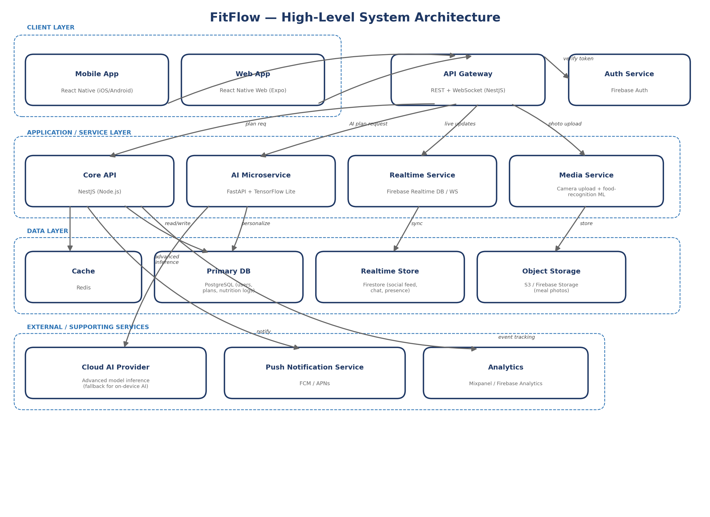

# FitFlow — High-Level Architecture

## Components

- **Client layer** — React Native mobile app (iOS/Android) and React Native Web app, sharing a
  single codebase (Expo). Handles the Home Dashboard, AI Workout Planner, Progress Tracking,
  Community Feed, and Nutrition Logger screens designed in Lab 03.
- **API Gateway** — A NestJS service exposing REST endpoints and a WebSocket gateway, sitting
  in front of all backend services. Verifies auth tokens with the Auth Service on every request.
- **Auth Service** — Firebase Auth, handling sign-up/sign-in, session tokens, and social login.
- **Core API** — NestJS service owning users, workout plans, and nutrition log business logic;
  reads/writes to PostgreSQL.
- **AI Microservice** — A separate FastAPI service running the personalization model
  (TensorFlow Lite on-device where possible, with a cloud AI provider as fallback for heavier
  inference). Kept isolated from the Core API so ML dependencies and scaling needs don't affect
  the rest of the backend.
- **Realtime Service** — Firebase Realtime DB/Firestore-backed service for the social feed,
  presence, and live coaching nudges.
- **Media Service** — Handles meal-photo uploads from the Nutrition Logger and coordinates
  food-recognition inference, storing images in Object Storage.
- **Cache** — Redis, used for session/token caching and accelerating frequently read data such as
  the home dashboard summary and the day's AI plan.
- **Data layer** — PostgreSQL as the system of record (users, plans, nutrition logs); Firestore for
  real-time/social data; S3/Firebase Storage for meal photos.
- **External/supporting services** — a cloud AI provider for advanced model inference beyond
  what runs on-device; push notifications (FCM/APNs) for re-engagement nudges; analytics
  (Mixpanel/Firebase Analytics) for the same usage tracking used in the original research.

## Data flows for critical features

**Personalized workout plan:** Client → API Gateway (auth verified) → Core API → AI
Microservice (reads recent activity + schedule constraints from PostgreSQL) → generates/updates
plan → Core API caches the day's plan in Redis → returned to client. If the on-device model needs
more compute, the AI Microservice calls the Cloud AI Provider as a fallback.

**Social sharing:** Client posts an update → API Gateway → Realtime Service writes to
Firestore → Firestore pushes the update to all circle members' clients in real time via the existing
Firebase subscription, without a manual polling round-trip.

**Nutrition tracking:** Client captures a meal photo → API Gateway → Media Service stores the
image in Object Storage and passes it to the food-recognition model → result is written to
PostgreSQL (as part of the user's nutrition log) → confirmation returned to client, and the entry
also appears in the Progress Tracking screen on next load.

## Security considerations

- All traffic between client and API Gateway is over HTTPS/TLS; WebSocket connections use WSS.
- Auth tokens are short-lived JWTs issued by Firebase Auth and verified on every API Gateway
  request; refresh tokens are stored using platform secure-storage APIs on the client.
- PostgreSQL data (nutrition logs, workout history) is encrypted at rest, consistent with GDPR/CCPA
  handling described in the original case study; access is scoped per-user at the Core API layer,
  never exposed directly to clients.
- Meal photos in Object Storage use signed, time-limited URLs rather than public access.
- The AI Microservice never receives more user data than a given inference call requires
  (minimization), and on-device inference is preferred specifically to avoid transmitting raw
  activity data off-device where possible.

## Scalability considerations

- The Core API, AI Microservice, Realtime Service, and Media Service are deployed as
  independently scalable services, so a spike in nutrition-photo uploads (e.g. after a marketing
  push) does not require scaling the entire backend.
- PostgreSQL can scale vertically first, then via read replicas for reporting/analytics workloads,
  deferring the complexity of sharding until it's actually needed at FitFlow's scale.
- Firestore and Firebase Auth are managed services that scale automatically with usage.
- Redis absorbs read pressure on hot paths (today's plan, dashboard summary) so traffic growth
  hits the cache before it hits PostgreSQL.

## Integration considerations

- The AI Microservice is intentionally decoupled from the Core API via an internal API contract,
  so the ML team can iterate on models independently of backend release cycles.
- Firebase (Auth + Firestore) is used consistently across auth and real-time features specifically
  to minimize the number of third-party vendor integrations the small team has to maintain.
- Analytics and push notifications are treated as supporting services the Core API calls out to
  asynchronously (fire-and-forget where possible), so an outage in either does not block core
  user flows like logging a workout or a meal.
